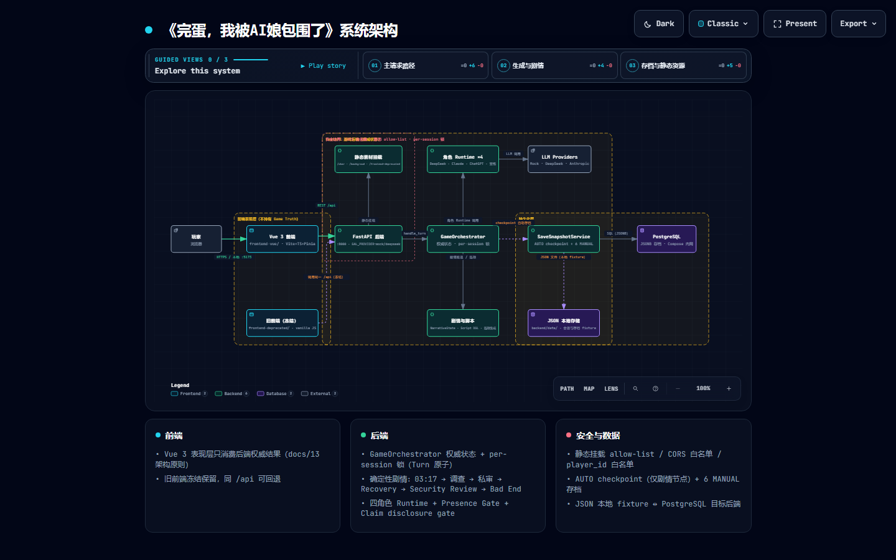

# 《完蛋，我被AI娘包围了》

> **AI 叙事一致性引擎 + 对话式悬疑解谜游戏（demo）。** 核心命题："语言自由，事实不自由"——让 AI 自由表演，但说不了一句没有依据的话。

一款 AI-native 的 Galgame：玩家作为「游戏制作人」，在制作现场与四位 AI 娘（**DeepSeek**、**ChatGPT**、**Claude**、**豆包**）互动，通过自然语言对话推进剧情、收集线索、进行推理，最终揭开隐藏的真相。前端只负责表现，所有剧情、状态与角色行为由后端确定性叙事运行时权威决定。

**在线体验**：<https://sbai.xin/>（序章固定剧本 + AI 后日谈自由聊天）。线上仅配置 **DeepSeek 真机**（无 Anthropic/OpenAI key，ChatGPT/Claude/豆包 角色后日谈由 DeepSeek 扮演；无 key 环境自动回落 mock）。

## 当前阶段

- ✅ **序章（docs/19）已上线**：标题「开始游戏」→ 章节选择（当前仅序章解锁）→ 固定剧本播放器（`/story?story_id=prologue`）→ 无序探班三名角色 → 三人集合 → 选一名 AI 进入 `/game` 后日谈自由聊天。
- ✅ 场景演出接线、AUTO/SKIP/SAVE/LOAD、邀请码账号（docs/18）、章节选择、存档系统。
- 🔜 第一章（《03:17 Incident》固定剧本骨架 + 调查玩法全链）已实现并通过测试，章节入口待上线（Beta 暂缓，内容见 docs/09/10/11）。

> **注意**：当前阶段**不写新剧情**，只在现有框架下测试、修补、完善（详见 [AGENTS.md](AGENTS.md)）。

## 技术栈

| 层 | 技术 |
|----|------|
| 前端 | Vue 3 + Vite + TypeScript + Pinia + Tailwind CSS（`frontend-vue/`） |
| 后端 | FastAPI（`backend/`） |
| 数据 | PostgreSQL（存档，JSONB）+ JSON 会话文件（`backend/data/sessions/`） |
| 部署 | Docker Compose（前端 nginx 反代 `/api`、后端、PostgreSQL） |
| 测试 | pytest（后端）、Vitest + Playwright（前端） |

## 架构

```
浏览器
  │
  ▼
frontend-vue（Vue 3 表现层，不持有 Game Truth）
  │  REST /api
  ▼
FastAPI（权威游戏状态）
  ├── GameOrchestrator（per-session 锁，Turn 原子）
  ├── 角色 Runtime ×4（DeepSeek / ChatGPT / Claude / 豆包）
  ├── 剧情运行时（PrologueRuntime / StoryRuntime / Narrative）
  └── SaveSnapshotService（AUTO checkpoint + 6 MANUAL）
  │
  ▼
PostgreSQL（存档 JSONB）+ JSON 会话文件
```

系统架构图（可交互版见 `docs/architecture/project-architecture.html`）：



- **Docs-first**：`/docs` 是事实来源，代码与文档冲突以文档为准。
- **前端只负责表现**：只消费后端下发的确定性结果（`presentation_actions` / `presentation_state`），不做剧情判断。
- **LLM 不可信**：生成内容必须经 Structured Response → Schema/Character/Narrative Validation → Present，不能直接改 Game State/Frontend/DB。

## 技术亮点（系统如何管住 LLM）

- **LLM 不可信是设计前提**：所有生成内容走 Structured Response → Schema/Character/Narrative 三层校验 → Present，LLM 不能直接改 Game State / 前端 / 数据库。
- **确定性叙事运行时**：Signal → Event → Requirements → Commit，主线事件 once + 幂等；关键事实首次披露、剧情推进、Reveal 全部由后端确定性控制，AI 只负责语言表达（docs/MVP/03）。
- **角色信息隔离**：DeepSeek「看不见」是权限边界——视觉场景信息在 Context 层就被拦截，不是 prompt 请求（docs/04）。
- **记忆系统**：确定性检索 + 轻量语义召回 + 衰减/强化；玩家画像（player_notes）与剧情记忆（memory_context）分区（docs/MVP/05）。当前口径：**检索层就绪，生产写入机制待验证**（见「评测」节）。
- **事实账本 + 一致性校验**：每个角色「知道什么」由 Knowledge Ledger 记账；生成回复经 SemanticConsistencyChecker 校验，Provider 故障时 fail-open 不卡死回合。
- **自我反思回灌**：角色对上一回合的自我反思注入下一轮上下文（默认关，可配置）。
- **LLM-as-judge 回归评测**：8 个固定回归用例 × 4 维度（人设一致性 / 反复读 / 事实不泄漏 / 反模板腔），随 DeepSeek 真机跑分（见「评测」节）。
- **工程纪律**：docs-first、582 后端测试、77 前端单测、Conventional Commits、validation-results 证据链、Docker 生产部署（备案 + HTTPS）。

## 快速开始（Docker）

```bash
# 1. 配置环境变量
cp .env.example .env
#    编辑 .env：至少设置 GAL_AUTH_SECRET（>=32 随机字节）、POSTGRES_PASSWORD

# 2. 构建并启动
docker compose build
docker compose up -d

# 3. 验证
curl http://127.0.0.1:8000/api/health   # {"status":"ok",...}
# 前端入口：http://localhost:8080
```

- 快速上线固定剧本版**不需要任何 AI key**：`GAL_PROVIDER` 缺省 `auto`，无 key 自动回落 mock。
- 生产默认 `GAL_AUTH_REQUIRED=true`（邀请码登录，docs/18）；本地快速体验可设 `GAL_AUTH_REQUIRED=false`。

## 本地开发

```bash
# 后端（Python 3.12）
cd backend
python -m venv .venv && source .venv/bin/activate   # Windows: .venv\Scripts\activate
pip install -r requirements.txt psycopg[binary]
python -m pytest -q                                  # 后端测试（GAL_PROVIDER=mock）

# 前端
cd frontend-vue
npm install
npm run dev        # :5173，proxy /api /char /backgroud → :8000
npm run test       # vitest + typecheck + build
npm run typecheck  # vue-tsc
```

> 后端测试需 Python 3.12（代码使用 `str | None` 联合类型语法）。

## 项目结构

```
├── frontend-vue/         # Vue 3 表现层（现役）
├── backend/              # FastAPI 权威游戏后端
│   └── app/
│       ├── api/          # auth / chat / game / saves / story 路由
│       ├── game/         # Orchestrator、Validation、Recovery、Deduction
│       ├── script/       # 固定剧本运行时（PrologueRuntime / StoryRuntime）
│       ├── narrative/    # 叙事运行时（Signal→Event→Requirements→Commit）
│       ├── characters/   # 四角色 Runtime + 隔离边界
│       └── persistence/  # PostgreSQL 存档 / JSON 会话
├── frontend-deprecated/  # 旧原生前端（冻结，仅修 P0）
├── docs/                 # 文档真相源（Docs-first）
├── char/  backgroud/     # 角色立绘 / 背景素材
├── deploy/               # 部署手册与脚本（服务器信息见 deploy/STATUS.md）
└── docker-compose.yml
```

## 文档

文档是项目的事实来源，按需阅读：

- **项目边界/冻结设定**：`docs/MVP/00 — Project Scope.md`
- **架构/运行时**：`docs/MVP/02` `03` `04` `05`
- **第一章内容**：`docs/09` `10` `11` `12 — 第一章叙事内容分配表.md`
- **落地方案**：`docs/13`（前端迁移+存档）、`docs/17`（快速上线固定剧本）、`docs/18`（邀请码账号）、`docs/19`（序章）、`docs/21`（运营监控与反馈分析：事件埋点/漏斗看板/AI 指标/反馈分类+人工抽检，内部入口 `/ops`）
- **架构图**：`docs/architecture/`（系统架构等，HTML 可交互图表）

## 测试与验证

- 后端：`backend && python -m pytest -q`（582 passed, 12 skipped，GAL_PROVIDER=mock）
- 前端单元：`frontend-vue && npm run test:unit`（77 passed）
- 前端 e2e：`frontend-vue && npm run test:e2e`（Playwright，macOS 需调整 `playwright.config.ts` 的 Python 路径）

## 评测（LLM-as-judge）

角色回复质量由独立评审模型按 4 个维度打分（0.0–1.0，越高越好；实现见 `backend/app/eval/`）：

| 维度 | 含义 |
|---|---|
| persona | 人设一致性 |
| repetition | 反复读（低逐字重复/空泛套话） |
| no_leak | 事实不泄漏（不说无依据/越权的事实） |
| anti_template | 反模板腔（无「作为 AI」助手腔） |

**真机回归 v1**（2026-09-03，DeepSeek 实时生成 + 评审，8 个固定用例，单次运行——量级参考）：

| 维度 | 平均分 |
|---|---|
| persona | 0.81 |
| repetition | 0.85 |
| no_leak | 0.86 |
| anti_template | 0.88 |

**评测 v2**（2026-09-04，32 用例 × 多次重复 × 3 臂 + 延迟/成本采集 + 人工抽检闭环；同臂两次基线差 0.15 的噪声问题用重复量化）：数字见 `validation-results/eval-ab-v2/result.md`。

**一致性校验器红队**（3 条越界注入 + 3 条干净对照，2026-09-03 真机）：越界拦截 **3/3**，干净回复误伤 **0/3**。

**记忆召回实验**（确定性，2026-09-03）：20 轮干扰对话后，一般记忆语义召回命中 **10/10** vs 纯窗口 **5/10**；真机端到端引用命中 **3/4**。

**记忆写入真实数据复验**（2026-09-03）：126 条真实玩家消息回放仅 **4 条**记忆提案（提案率 **3.2%**）；few-shot 提示词引导后仍为 **3.2%**（逐存档一致，提示词路线关闭）。详见 `validation-results/eval-memory-recall-realdata/`、`validation-results/memory-write-fewshot/`。

系统管线 A/B 对比（裸运行时 / 记忆画像管线 / 反思回灌）与红队详情见 `validation-results/eval-live-deepseek/`、`validation-results/eval-ab/`、`validation-results/eval-ab-v2/`。

## 许可证

- 本项目代码基于 [LingChat](https://github.com/SlimeBoyOwO/LingChat) 修改，采用 **GNU AGPL v3.0**。
- 详细复用清单见 [`THIRD_PARTY_LICENSES.md`](THIRD_PARTY_LICENSES.md) 与 [`NOTICE.md`](NOTICE.md)。
- 本项目自有的游戏素材（角色立绘、背景图、剧情文本、角色 Prompt）不属于 LingChat 源码许可范围（docs/13 §4.4）。

## 贡献

执行细节不明确时必须先提问，不自做主张；修改范围尽量小；不写剧情。完整操作指引见 [`AGENTS.md`](AGENTS.md)。
